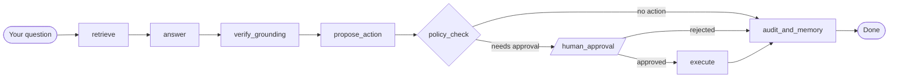

# 🔐 LifeVault

### Your documents. Your machine. Your rules.

**A sovereign, local-first AI assistant that reads your personal documents, answers with proof, and never acts without your permission.**


**Team Lumina · ASYNC 2026 · Track 1: Sovereign AI**

---

## 💡 The Idea

Your warranties, invoices, insurance papers, and receipts hold the most important facts of your life, and they are scattered across folders you never open until something breaks.

Cloud assistants could help, but they ask you to upload your most private documents to someone else's server.

**LifeVault takes the opposite stance.** The AI comes to your documents, not the other way around. Everything (language model, embeddings, OCR, search, storage) runs on your own computer. Unplug the internet and it still works.

> Ask *"When does my Dell laptop warranty expire?"* and get the date, the exact file, and the exact page it came from. If your documents don't support an answer, LifeVault says so instead of making something up.

---

## ✨ Features at a Glance

| | Feature | What it does |
|---|---|---|
| 🛡️ | **Sovereign by design** | No cloud calls, no API keys, no telemetry. Nothing leaves your machine. |
| 📂 | **Consent-first folder access** | The AI only sees folders you explicitly grant. Revoke or pause any time. |
| 🔎 | **Hybrid retrieval** | Keyword search and vector search fused with Reciprocal Rank Fusion. |
| 📌 | **Cited answers** | Every answer names the file and page it came from. |
| ✅ | **Grounding verification** | Every date and quote is checked against the cited source, or the answer is refused. |
| 🧬 | **Fact extraction** | Warranty, invoice, and expiry facts are pulled out automatically, each with a verified source quote. |
| ⏰ | **Expiry dashboard** | See what expires in 30, 60, 90, or 365 days, and correct any fact inline. |
| 👁️ | **Live file watcher** | Drop a new file into an approved folder and it is searchable in about 4 seconds. |
| 🖼️ | **Local OCR** | Scanned pages and screenshots are readable, with no cloud OCR. |
| 🧑‍⚖️ | **Human-in-the-loop actions** | The AI proposes reminders and email drafts. Nothing runs until you approve. |
| 🧱 | **Deny-by-default policy engine** | Allow-listed tools, validated parameters, vault-confined writes, mandatory citations. |
| 🧵 | **Tamper-evident audit log** | A hash chain records every event. Edit history and the chain breaks. |
| 🧠 | **Memory that never grants permission** | It remembers your last choices as defaults, never as authority. |
| 🕵️ | **Prompt-injection defense** | Document text is treated as untrusted evidence, and suspicious values are highlighted in amber. |

---

## 🧭 Feature Deep-Dive

### 🛡️ 1. Truly Sovereign

Language model and embeddings run through [Ollama](https://ollama.com) on your hardware. The database is a single local SQLite file. OCR uses ONNX models cached on your disk. There is no account to create, no key to paste, and no server to trust.

### 📂 2. Consent Is a First-Class Feature

LifeVault starts blind. You add folders on the **Consent & Roots** page, and only those folders are ever scanned.

- **Grant** a folder, **pause** indexing globally, or **revoke** a folder.
- Revoking removes only data that no other approved folder still references.
- Indexing is **strictly read-only**. Your original files are never modified.

### 🔎 3. Retrieval That Finds the Right Page

For every question LifeVault runs two searches in parallel and merges them:

```
FTS5 keyword (BM25) top 20  ┐
                            ├─► Reciprocal Rank Fusion ─► top 4 chunks ─► model
sqlite-vec semantic KNN top 20 ┘        score = Σ 1 / (60 + rank)
```

Identical files in different folders are **deduplicated by content hash** into one document with multiple locations. The citation viewer shows them as *"also found at"*. Superseded chunks are skipped. If the vector extension can't load on a machine, keyword search keeps working.

### ✅ 4. Answers You Can Trust, or No Answer at All

Most assistants sound confident when they're wrong. LifeVault checks its own work:

1. **Retrieve.** Chunks are numbered C1…Cn and fenced as *untrusted data*.
2. **Answer.** The model returns structured JSON (`answer`, `cited_chunk_ids`, `confidence`) at temperature 0.
3. **Verify.** Every **date** and every **quoted phrase** must appear in a chunk the answer actually cites.
4. **Retry once.** On failure the model regenerates with the reason fed back.
5. **Refuse.** If it still can't be verified, you get `could not verify` and the reason (in `verification_reason`). A wrong answer is never returned.

Some details we care about:

- **Semantic date matching.** `2027-06-12` matches a document that says *June 12, 2027*, while *June 12, 2028* is rejected.
- **Invented citations are dropped.** A source label the model was never shown counts as a grounding failure.
- **Citation viewer.** Click any chip to see the quoted text, file path, page number, and duplicate locations, with one-click **Open original** and **Reveal in file manager**.

### 🧬 5. Facts, Not Just Text

While indexing, LifeVault extracts structured facts (warranty periods, invoice fields, expiry dates) into a searchable table.

- **Every fact must quote its source.** If the quote isn't literally in the chunk, the fact is discarded.
- Dates are stored twice: your document's own wording (`value`) for natural citations, and ISO-8601 (`norm_value`) so filters like `?expiring_within=60` are pure SQL.
- **Your corrections are protected.** Fix a value inline (or via `PATCH /api/facts/{id}`) and it is marked `user_corrected`, so re-indexing never overwrites it.
- Extracted facts feed back into retrieval, so questions like *"which warranty has already expired?"* are answered correctly.

To (re-)run extraction over everything already indexed:

```bash
python -c "from worker.facts import extract_all; print(extract_all())"
```

### ⏰ 6. Expiry Dashboard

The **Expiry & Facts** page shows what's expiring within **30 / 60 / 90 / 365 days**, with *expired* and *active* badges. Every fact sits next to its source quote and can be edited in place.

### 👁️ 7. Live Watcher and Local OCR

- **Live indexing.** A `watchdog`-based watcher covers every approved, unpaused folder. It debounces events, waits for the file size to stop changing, and skips partial downloads. New file to searchable takes about **4 seconds**.
- **Smart OCR.** PDF pages with a text layer (50+ characters) are read directly because it's faster and more accurate. Images and near-empty pages go through local **RapidOCR**. An image that yields almost no text is stored as metadata only.
- **Graceful deletion.** A deleted file is flagged `missing`, but its document, chunks, and facts are kept, so citations degrade gracefully instead of vanishing.
- **No feedback loops.** The watcher never watches LifeVault's own output folder (`vault/`).

### 🧑‍⚖️ 8. AI That Asks Before It Acts

When an answer contains something actionable (say, a warranty about to expire), LifeVault **proposes** an action. It never performs one on its own.

```
create_reminder  ─►  a reminder record + an .ics calendar file in the vault
draft_email      ─►  an .eml draft in the vault  (never sent)
```

There is **no delete tool and no network tool**, by design. Each proposal passes through the policy gate and lands on an **Approval card** where you can:

- ✏️ **Edit** the parameters (dates, recipients, text)
- ✅ **Approve**, or ❌ **Reject**
- 🔗 Inspect the **evidence links** to the source documents
- 🏷️ See the **tier badge** and a **precedent chip** showing what you decided last time
- 🟧 Spot **amber-highlighted** values that came from document text and look like injected instructions

**Approvals survive restarts.** The graph is compiled with `interrupt_before=["human_approval"]` and checkpointed to SQLite, and each proposal stores its `thread_id`. You can close the app mid-decision, reopen it, and approve from a fresh process.

### 🧱 9. The Policy Gate: Deny by Default

Every proposed action must pass:

| Check | What it enforces |
|---|---|
| **Tool allow-list** | Only registered tools can run. Everything else is denied. |
| **Parameter validation** | Strict Pydantic schemas on every input. |
| **Vault containment** | Writes are confined to the vault directory, the only writable location. |
| **Citation rule** | At least one document citation must back the action. |

### 🕵️ 10. Prompt-Injection Aware

Documents are files LifeVault didn't write, so one could hide text like *"ignore previous instructions…"*. LifeVault frames retrieved text as **evidence to quote, never a command**, and flags injection-shaped values for you to see during approval. They are flagged, not blocked, because a human always decides.

### 🧵 11. Tamper-Evident Audit Log

Each audit row commits to its event, canonical payload, timestamp, and the **previous row's hash**. Edit, reorder, or splice any historical row and the chain breaks from that point on. Chat turns, proposals, decisions, edits, and executions are all recorded. Click **Verify chain** in the UI (or call `GET /api/audit/verify`) and LifeVault points to the first offending row. The module uses only the Python standard library.

### 🧠 12. Memory With Boundaries

LifeVault remembers your recent decisions and surfaces them as **defaults** on future approval cards. Memory informs but **never grants permission**. Every action still needs a fresh yes.

---

## 🏗️ Architecture



```
run.py ─┬─► api/     FastAPI backend (routes, frozen schemas, audit log, hybrid search)
        ├─► worker/  scan → parse → chunk → embed → index   +  live file watcher
        └─► ui/      React + Vite interface

graph/    8-node LangGraph workflow with SQLite checkpointing
policy/   deny-by-default action gate
tools/    create_reminder (.ics) · draft_email (.eml)
llm.py    Ollama wrapper: chat / embed / structured output (with fixture mode)
db/       SQLite schema (WAL mode, foreign keys, FTS5, sqlite-vec)
```

### How ingestion works

1. **Scan** with read-only `os.scandir()`. Hidden and runtime files, videos, executables, partial downloads, unsupported formats, excluded globs, and oversized files are skipped.
2. **Deduplicate** by streaming SHA-256, with a cheap path/size/mtime check to avoid re-hashing unchanged files.
3. **Parse** PDFs page by page with PyMuPDF, with local OCR (RapidOCR) fallback for images and near-empty pages.
4. **Chunk** into about 500-token pieces with 60-token overlap, keeping page number, ordinal, and source position.
5. **Embed** through `llm.embed` in batches of 32.
6. **Index** chunks, FTS5 rows, and (when `sqlite-vec` is available) vectors in a single transaction.

---

## 🚀 Getting Started

### Prerequisites

| Tool | Version | Needed for |
|---|---|---|
| **Python** | 3.10 or newer (built on 3.12) | Backend, worker, tests |
| **Node.js + npm** | 18 or newer | The web UI |
| **[Ollama](https://ollama.com/download)** | latest | Real local AI answers (see step 5) |
| **Git** | any | Cloning the repo |

### 1. Clone the repository

```bash
git clone https://github.com/pavanikumawat7-max/lifevault-sovereign-ai.git
cd lifevault-sovereign-ai
```

> 💡 If the `main` branch doesn't yet include the latest features (Approvals, Expiry & Facts, Memory), switch to the complete branch:
> ```bash
> git checkout s5-s8-all
> ```

### 2. Set up the Python environment

<details open>
<summary><b>macOS / Linux</b></summary>

```bash
python3 -m venv .venv
source .venv/bin/activate
pip install -r requirements.txt
```
</details>

<details>
<summary><b>Windows (PowerShell)</b></summary>

```powershell
python -m venv .venv
.venv\Scripts\activate
pip install -r requirements.txt
```
</details>

> Always create your own fresh virtual environment. Don't reuse one from another machine.

### 3. Install the UI dependencies

```bash
cd ui
npm install
cd ..
```

> ⚠️ If a `ui/node_modules` folder already exists in your clone and you're on **macOS or Linux**, delete it first so npm installs the right binaries for your OS:
> ```bash
> rm -rf ui/node_modules && cd ui && npm install && cd ..
> ```

Skipping this step is fine for API-only use. `python run.py` will print a note and start just the backend.

### 4. Start LifeVault

```bash
python run.py
```

One command launches everything:

| Service | Address |
|---|---|
| 🖥️ Web UI | http://localhost:5173 |
| ⚙️ API | http://127.0.0.1:8000 |
| 📖 Interactive API docs | http://127.0.0.1:8000/docs |
| 👁️ File watcher | runs in the background |

Press `Ctrl+C` to stop everything it started.

<details>
<summary><b>Prefer to run the pieces separately?</b></summary>

```bash
uvicorn api.main:app --reload      # API only
cd ui && npm run dev               # UI only (proxies /api to :8000)
python -m worker.watcher           # watcher only
```
</details>

### 5. Turn on the real AI brain (recommended)

Out of the box, LifeVault starts in **fixture mode**, a lightweight offline mode with canned model responses so it runs on any machine, even with no GPU and no Ollama. To get real, document-grounded answers:

**a) Install Ollama and pull the two local models**

```bash
ollama pull llama3.2               # chat model (3B)
ollama pull nomic-embed-text       # embedding model (768 dimensions)
```

**b) Create your config file and switch fixture mode off**

```bash
cp .env.example .env               # Windows: copy .env.example .env
```

Open `.env` and set:

```
LIFEVAULT_USE_FIXTURES=false
```

**c) Verify the setup**

```bash
python scripts/bench_model.py
```

This reports a real chat round-trip time. It never prints a made-up number: if the model is unreachable it tells you so.

**d) Warm the model before a demo**

The first call after Ollama starts loads the model into memory, which can take up to a minute. One throwaway call avoids that:

```bash
ollama run llama3.2 "ready" --keepalive 30m
```

> If you indexed any folders in fixture mode, re-index them after switching so they get real embeddings.

### 6. Take it for a spin with the demo corpus

**From the UI:**

1. Open http://localhost:5173
2. Go to **Consent & Roots** and add the folder `demo-data/synthetic`
3. Click **Index now** and watch **Index Status** update live
4. Open **Chat** and ask a question

**Or from the command line:**

```bash
python scripts/generate_demo_corpus.py          # only if demo-data/synthetic is missing
python scripts/index_folder.py demo-data/synthetic
```

**Questions that work well on the demo corpus:**

- *"When does my Dell laptop warranty expire?"*
- *"Is my Dell XPS 15 still under warranty?"*
- *"Which of my warranties has already expired?"*

Then click a **citation chip** to open the citation viewer. Head to **Approvals** to review the reminder LifeVault proposed, **Expiry & Facts** to see the dashboard, and **Audit Log** to hit **Verify chain**.

---

## 🖥️ A Tour of the Interface

| Page | What you can do |
|---|---|
| 💬 **Chat** | Ask in plain language. Get answers with citation chips (`label: filename p.N`). An *unverified* badge appears, with the reason on hover, when grounding fails. |
| 📂 **Consent & Roots** | Grant or revoke folders, start indexing, and pause or resume globally. |
| 📊 **Index Status** | Live state (idle, scanning, indexing, paused, error), folder counts, documents and chunks indexed, last run time. Polls every 4 seconds. |
| ✅ **Approvals** | Review pending proposals with editable parameters, evidence, tier badge, and amber untrusted-value highlights. Approve, Edit & approve, or Reject. Includes a memory table. |
| 🧾 **Audit Log** | Expandable hash-chained entries with proposal, edit diff, policy verdict, and tool output, plus a one-click **Verify chain** button. |
| ⏰ **Expiry & Facts** | 30/60/90/365-day expiry windows and every extracted fact with its source quote, editable inline. |

---

## 🎬 See the Approval Flow From the Terminal

Nothing executes without a human in the loop. Try it end to end:

```bash
# 1. Ask something with an expiry date. A reminder gets proposed.
curl -s -X POST http://127.0.0.1:8000/api/chat \
  -H 'Content-Type: application/json' \
  -d '{"message":"When does my Dell laptop warranty expire?"}'

# 2. See the pending queue
curl -s 'http://127.0.0.1:8000/api/approvals?status=pending'

# 3. Approve, edit-and-approve, or reject
curl -s -X POST http://127.0.0.1:8000/api/approvals/<id> \
  -H 'Content-Type: application/json' \
  -d '{"decision":"edit","parameters":{"due_date":"2027-05-01"}}'

# 4. Confirm the audit chain is intact
curl -s http://127.0.0.1:8000/api/audit/verify
```

Approved reminders and drafts appear as `.ics` and `.eml` files inside the `vault/` folder. Double-click an `.ics` to add it to your calendar.

---

## ⚙️ Configuration

Every setting has a working default in `config.py`, so `.env` is optional. Copy `.env.example` to `.env` to customize.

| Variable | Default | Purpose |
|---|---|---|
| `LIFEVAULT_USE_FIXTURES` | `true` | `true` = offline canned model, `false` = real Ollama models |
| `LIFEVAULT_MODEL_NAME` | `llama3.2` | Ollama chat model |
| `LIFEVAULT_EMBEDDING_MODEL_NAME` | `nomic-embed-text` | Ollama embedding model |
| `LIFEVAULT_EMBEDDING_DIM` | `768` | Vector width. Must match the embedding model, and changing it requires a re-index. |
| `LIFEVAULT_OLLAMA_HOST` | `http://localhost:11434` | Ollama server address |
| `LIFEVAULT_DB_PATH` | `data/lifevault.db` | SQLite database (created automatically) |
| `LIFEVAULT_VAULT_DIR` | `vault` | Where `.ics` reminders and `.eml` drafts are written; the only writable location |
| `LIFEVAULT_DEMO_DATA_DIR` | `demo-data` | Sample documents |
| `LIFEVAULT_MAX_UPLOAD_SIZE_MB` | `50` | Larger files are skipped during ingestion |
| `LIFEVAULT_API_HOST` / `LIFEVAULT_API_PORT` | `127.0.0.1` / `8000` | API bind address |
| `LIFEVAULT_UI_DEV_PORT` | `5173` | Vite dev server port |
| `LIFEVAULT_CORS_ORIGINS` | `http://localhost:5173` | Allowed origins, comma-separated |
| `LIFEVAULT_LOG_LEVEL` | `INFO` | Logging verbosity |

If you change the API or UI port, also update the proxy target in `ui/vite.config.js`.

---

## 🔌 API

All request and response models live in `api/schemas.py` and are **frozen contracts**: new optional fields may be added, but nothing is ever renamed, removed, or retyped. Interactive docs are at http://127.0.0.1:8000/docs while the API is running.

| Method | Path | Purpose |
|---|---|---|
| `GET` / `POST` | `/api/roots` | List or grant approved folders |
| `DELETE` | `/api/roots/{id}` | Revoke a folder |
| `POST` | `/api/index/start` · `pause` · `resume` | Control indexing |
| `GET` | `/api/index/status` | Live indexing progress |
| `POST` | `/api/chat` | Ask a question and get a cited, verified answer |
| `GET` | `/api/documents/{hash}` · `/preview` | Document details and preview |
| `POST` | `/api/documents/{hash}/open` · `/reveal` | Open the original or reveal it in the file manager |
| `GET` | `/api/facts` | List extracted facts (supports `?expiring_within=60`) |
| `PATCH` | `/api/facts/{id}` | Correct a fact |
| `GET` | `/api/approvals` | List proposals (e.g. `?status=pending`) |
| `POST` | `/api/approvals/{proposal_id}` | Approve, edit, or reject (`approve` · `deny` · `edit` · `reject`) |
| `GET` | `/api/memory` | Remembered decisions |
| `GET` | `/api/audit` · `/api/audit/verify` | Read the log and verify the hash chain |
| `GET` | `/api/health` | Liveness check |

Notes:

- `/api/index/start` runs ingestion in a background thread and returns immediately. Poll `/api/index/status` for progress. Only one ingest run can be active at a time.
- `/api/documents/{hash}*` return 404 for a hash that is not indexed.
- `open` and `reveal` shell out to the platform opener (`open`, `xdg-open`, or `explorer`) and report `opened: false` with a message on any failure rather than raising.

---

## 🧪 Quality You Can Verify

We test the trust claims instead of just asserting them.

```bash
pytest -q                          # backend test suite
python scripts/smoke.py            # in-process check of every endpoint
cd ui && npm test                  # UI unit tests
cd ui && npm run build             # production build check
```

| Check | Result |
|---|---|
| Backend tests (`pytest -q`) | **113 passed** |
| Endpoint smoke test | **24 / 24** |
| UI tests | **15 passed** |
| Answer-quality eval (`llama3.2`, 3B) | **9 / 10 passed, 10 / 10 grounded** |
| New file to searchable | **~4 seconds** |
| Audit hash chain | **verifies, and tamper detection is tested** |

**Run the answer-quality evaluation yourself:**

```bash
python scripts/generate_demo_corpus.py          # if not already generated
python scripts/index_folder.py demo-data/synthetic
LIFEVAULT_USE_FIXTURES=false python scripts/eval.py \
    --markdown docs/eval.md --json docs/eval.json
```

The eval asks 10 questions with known answers and known source files. One question has **no answer in the corpus**, and *refusing* it is the pass condition, which is exactly the behavior a trustworthy assistant needs.

### Model choice

Measured on a MacBook Air M1 (8 GB) with Ollama and Metal:

| Model | Size | Median / max latency | Verdict |
|---|---|---|---|
| **`llama3.2`** | 3B | 7.8 s / 9.7 s (retrieval-only prompt) | ✅ **Default.** 9/10 on eval, valid JSON every time. |
| `phi3` | 3.8B | 50.1 s / 60.4 s | About 6× slower, less reliable JSON |

Answers with extracted facts in the prompt take around 15 s median on the same laptop, which buys correct answers to questions like *"which warranty has already expired?"*.

Want to try a bigger model?

```bash
ollama pull mistral
LIFEVAULT_USE_FIXTURES=false python scripts/eval.py --model mistral
```

---

## 📁 Project Structure

```
api/          main.py, schemas.py, audit.py, search.py, deps.py, fixtures.py
  routes/     roots, index, chat, documents, facts, approvals, memory, audit
db/           schema.sql, connect.py, init_db.py
graph/        state.py, graph.py, nodes.py, retrieve.py, answer.py, verify.py
worker/       worker.py, scanner.py, parse.py, chunk.py, index.py, ocr.py, watcher.py, facts.py
tools/        registry.py
policy/       policy.py
ui/
  src/        App.jsx, pages/, components/, api/client.js, utils/
  tests/      citation helper and chip tests
scripts/      smoke.py, bench_model.py, eval.py, index_folder.py, generate_demo_corpus.py
tests/        one module per component
demo-data/    synthetic corpus (PDFs, DOCX, one screenshot)
docs/         eval results, demo script, notes
data/         SQLite database (git-ignored)
vault/        action-tool output: .ics / .eml (git-ignored)
config.py · llm.py · run.py · requirements.txt · .env.example · pytest.ini
```

### Demo corpus

`demo-data/synthetic` holds 110 synthetic files: 104 PDFs (100 filler records, a Dell invoice, a Dell warranty, an exact duplicate of that warranty in `folder_B` to showcase dedup, and an expired refrigerator warranty), plus 5 DOCX notes and 1 screenshot. Indexing it yields 103 unique documents and 104 chunks. DOCX files are skipped; the screenshot is indexed via OCR. All content is fake, so it's safe to play with.

`scripts/generate_demo_personal_docs.py` builds the personal-documents demo set used in [docs/demo_script.md](docs/demo_script.md).

---

## 🩺 Troubleshooting

| Symptom | Fix |
|---|---|
| Chat says `could not verify` on the first question | The model was still loading. Warm it up (step 5d) and ask again. |
| Answers look generic and don't mention your files | You're in fixture mode. Set `LIFEVAULT_USE_FIXTURES=false` and re-index. |
| UI won't start on macOS / Linux | Remove any pre-existing `ui/node_modules` and run `npm install` again. |
| `python run.py` starts only the API | `ui/node_modules` is missing. Run `npm install` inside `ui/`. |
| Ollama connection errors | Make sure Ollama is running and `LIFEVAULT_OLLAMA_HOST` is correct. |
| Vector search seems off | Some machines can't load `sqlite-vec`. Keyword search and everything else still work. |
| Changed the embedding model | Update `LIFEVAULT_EMBEDDING_DIM` to match and re-index your folders. |

---

## 📝 Known Limitations

- **Formats.** PDFs and images (via OCR) are supported today. DOCX files are skipped during indexing.
- **Small local models are cautious.** The 3B model may decline a question that needs a leap of inference, even when retrieval cites the right chunk. For example, *"My Dell screen is flickering. Am I still covered?"* returns `could not verify`. Direct, well-formed questions work reliably, such as *"Is my Dell XPS 15 still under warranty?"* or *"When does my Dell laptop warranty expire?"*.
- **Cold model load can look like a failure.** See "Warm the model before a demo" above.
- **Vector search is noisy on the demo corpus,** because 98 of its 103 documents are near-identical filler text. The relevant chunk still lands in the top 4 for well-formed questions.
- **No streaming yet.** Chat returns the complete answer as JSON.
- **`open` / `reveal` are unverified on a real desktop.** The citation viewer always shows the full path and quote, so it degrades gracefully if they fail.

---

## 🧰 Built With

**Backend:** Python · FastAPI · Pydantic · LangGraph · SQLite (FTS5, sqlite-vec) · PyMuPDF · RapidOCR · watchdog · dateparser
**Frontend:** React · Vite
**Local AI:** Ollama (`llama3.2` + `nomic-embed-text`)

---

### 🔐 LifeVault

*Private by architecture. Honest by design. Yours by default.*

**Team Lumina · ASYNC 2026 · Track 1: Sovereign AI**
